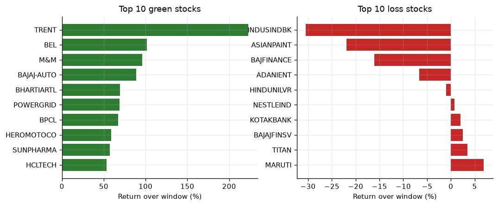
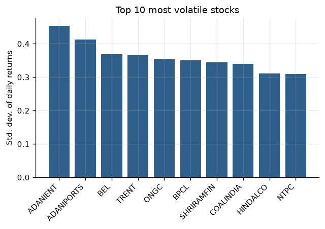
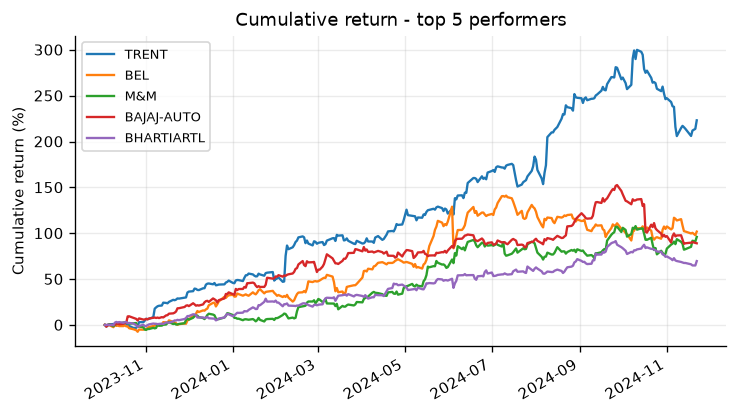
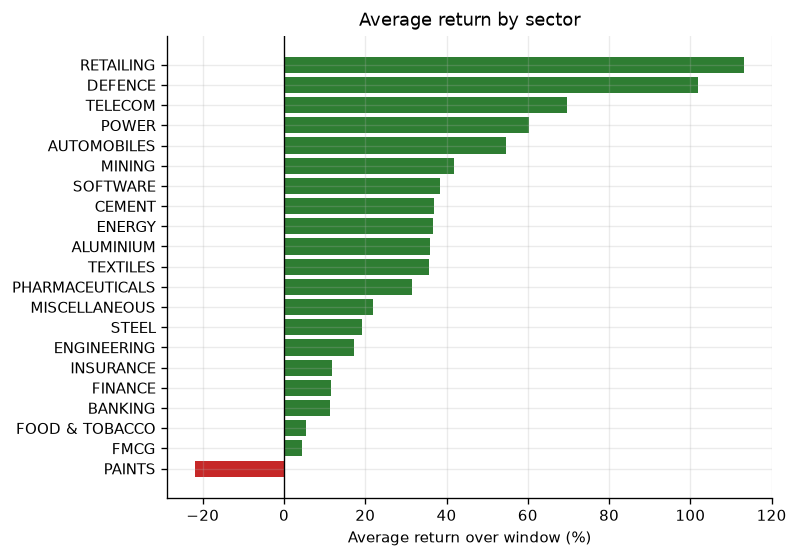
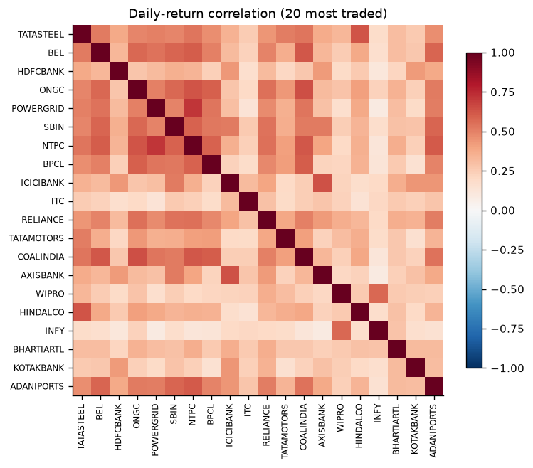
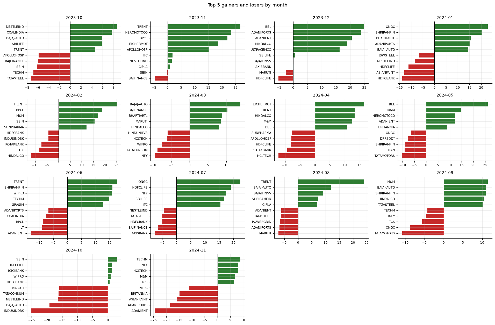

# Data-Driven Stock Analysis

Organizing, Cleaning, and Visualizing Market Trends — Nifty 50

An end-to-end analytics pipeline that ingests month-wise YAML market data,
transforms it into 50 per-symbol CSVs, cleans and loads it into SQL, computes
the full battery of required performance metrics, and serves everything through
a nine-page interactive Streamlit dashboard.

---

## 1. Project Overview & Architecture

### Problem statement

Investors need a single view of how the Nifty 50 performed over the past year:
which stocks gained, which collapsed, how volatile each was, how sectors
compared, and which stocks move together. Raw data arrives as month-wise YAML
folders, which is unusable for analysis until extracted and reshaped.

### Approach

| Stage | What happens | Where |
|---|---|---|
| Extract | Every `data/yaml_monthly/<YYYY-MM>/<YYYY-MM-DD_HH-MM-SS>.yaml` file is parsed and flattened — 284 daily files across 14 month folders | `read_yaml_records()` |
| Transform | Rows are grouped by ticker and written as **50 per-symbol CSVs** | `write_symbol_csvs()` |
| Clean | Numeric coercion, duplicate `(symbol, date)` removal, forward/back-fill of gaps, sector join | `clean_frame()` |
| Load | `executemany` insert into `stock_prices` / `stock_metrics` | `Database.load_*` |
| Analyse | Yearly return, annualised volatility, cumulative return, sector aggregates, correlation matrix, monthly rankings | `models.py` |
| Model | KMeans risk/return segmentation + per-stock market-beta linear regression | `models.py` |
| Serve | Nine-page Streamlit dashboard | `app.py` |

### Architecture

```
data/yaml_monthly/2023-10/2023-10-03_05-30-00.yaml  (284 files, 14 folders)
                    │
                    ▼  read_yaml_records()
            flattened DataFrame  (14,200 rows × 50 symbols)
                    │
        ┌───────────┴────────────┐
        ▼                        ▼
data/symbol_csv/*.csv     clean_frame() ──▶ data/all_stocks_cleaned.csv
   (50 files)                    │
                                 ▼
                     ┌───────────────────────┐
                     │ MySQL :3306 / SQLite  │
                     │ stock_prices          │
                     │ stock_metrics         │
                     └───────────┬───────────┘
                                 │
                    models.py ───┴──▶ artifacts/
                      • risk_return_scaler.pkl
                      • risk_return_kmeans.pkl
                      • market_beta_models.pkl
                                 │
                                 ▼
                              app.py  (Streamlit, 9 pages)
```

### Dataset

Two committed source files:

| Path | What it is |
|---|---|
| `data/yaml_monthly/` | 284 daily YAML files, `2023-10` → `2024-11`, 50 entries each (one per Nifty ticker). Keys: `Ticker`, `date`, `open`, `high`, `low`, `close`, `volume`, `month`. |
| `data/sector_data.csv` | Sector sheet: `COMPANY`, `sector`, `Symbol` where `Symbol` is `"COMPANY NAME: TICKER"`. 21 sectors. |

**Window.** The archive spans 2023-10-03 to 2024-11-29, so "yearly return"
throughout means first-to-last close across the supplied 14-month window,
not a calendar year.

**Sector resolution.** The ticker is parsed off the right-hand side of
`Symbol`. Four of the 50 YAML tickers do not appear in the sheet verbatim, and
each is resolved by an explicit override declared in `config.py`:

| Ticker | Why it needed an override |
|---|---|
| `ADANIENT` | Sheet row "ADANI ENTERPRISES" mis-types its symbol as `ADANIGREEN` |
| `BHARTIARTL` | Sheet lists it under symbol `AIRTEL` |
| `TATACONSUM` | Sheet lists it under symbol `TATACONSUMER` |
| `BRITANNIA` | Absent from the sheet entirely; classified by hand as `FOOD & TOBACCO` alongside ITC and Nestlé |

The pipeline prints a warning listing any ticker it still cannot map, so a
future sector-sheet change fails loudly rather than silently producing
"Unclassified".

### Required analyses — where each one lives

| Requirement | Function | Dashboard page |
|---|---|---|
| Top 10 green stocks | `top_green_stocks()` | Top Performers |
| Top 10 loss stocks | `top_loss_stocks()` | Top Performers |
| Market summary (green vs red, avg price, avg volume) | `market_summary()` | Market Overview |
| Volatility (σ of daily returns) | `compute_stock_metrics()` | Volatility Analysis |
| Cumulative return over time | `cumulative_return_series()` | Cumulative Returns |
| Sector-wise performance | `sector_performance()` | Sector Performance |
| Stock price correlation heatmap | `correlation_matrix()` | Correlation Heatmap |
| Monthly top-5 gainers and losers (12 charts) | `monthly_gainers_losers()` | Monthly Gainers & Losers |

### Database schema

```sql
stock_prices (
  symbol      VARCHAR(20) NOT NULL,
  trade_date  DATE        NOT NULL,
  open_price  DOUBLE      NOT NULL,
  high_price  DOUBLE      NOT NULL,
  low_price   DOUBLE      NOT NULL,
  close_price DOUBLE      NOT NULL,
  volume      BIGINT      NOT NULL,
  sector      VARCHAR(40),
  PRIMARY KEY (symbol, trade_date)
);

stock_metrics (
  symbol            VARCHAR(20) PRIMARY KEY,
  sector            VARCHAR(40),
  yearly_return_pct DOUBLE,
  volatility        DOUBLE,
  avg_close         DOUBLE,
  avg_volume        DOUBLE,
  cumulative_return DOUBLE
);
```

---

## 2. How to Execute the Project

### Prerequisites

* Python 3.10 – 3.14
* MySQL 8.x (**optional** — SQLite fallback is automatic)

### Step-by-step

```bash
# 1. Clone and enter the project
git clone https://github.com/prawin0309/Data-Driven-Stock-Analysis.git
cd Data-Driven-Stock-Analysis

# 2. Create and activate a virtual environment
python -m venv .venv
.venv\Scripts\Activate.ps1        # Windows PowerShell
source .venv/bin/activate         # macOS / Linux

# 3. Install dependencies
pip install -r requirements.txt

# 4. YAML -> 50 CSVs -> cleaned frame -> SQL
python data_pipeline.py

# 5. Metrics + KMeans + market-beta regressions (writes artifacts/*.pkl)
python models.py

# 6. Launch the dashboard
streamlit run app.py
```

Expected output from step 4:

```
[yaml] found 284 existing YAML files - reusing
[extract] parsed 284 YAML files -> 14200 rows
[transform] wrote 50 per-symbol CSV files to symbol_csv/
[sector] loaded 54 ticker->sector entries from sector_data.csv (+4 documented overrides)
[clean] 14200 -> 14200 rows, 50 symbols, 21 sectors
[transform] resolved sector mapping (50 tickers) written to sector_mapping.csv
[db] loaded 14200 price rows
[verify] stock_prices row count = 14200
Pipeline completed successfully.
```

Step 5 prints the market summary, both top-10 tables, the volatility ranking,
sector performance, KMeans segment counts, and the highest-beta stocks.

### Power BI

`data/all_stocks_cleaned.csv` and `data/stock_metrics.csv` are flat, tidy files
ready to be loaded directly into Power BI Desktop via **Get Data → Text/CSV**.
Alternatively connect Power BI to the MySQL `guvi_db` database and import the
`stock_prices` and `stock_metrics` tables.

---

## 3. Test Credentials & System Configurations

This dashboard is read-only and has **no login wall**, so an evaluator can open
it and start exploring immediately. Credentials below are for the database
layer.

### Database configuration

| Setting | Default | Environment variable |
|---|---|---|
| Host | `localhost` | `STOCK_DB_HOST` |
| Port | `3306` | `STOCK_DB_PORT` |
| User | `root` | `STOCK_DB_USER` |
| Password | `root` | `STOCK_DB_PASSWORD` |
| Database | `guvi_db` | `STOCK_DB_NAME` |
| Backend | `auto` (`mysql` \| `sqlite`) | `STOCK_DB_BACKEND` |

`guvi_db` is created automatically if it does not already exist.

```bash
# Force a real MySQL server
export STOCK_DB_BACKEND=mysql STOCK_DB_USER=root STOCK_DB_PASSWORD=your_password
python data_pipeline.py
```

With the default `auto` backend the pipeline tries MySQL on `localhost:3306`
and silently falls back to `data/guvi_db.sqlite3`, so the project runs
end to end with no database installation at all.

### Application configuration

| Setting | Default |
|---|---|
| Streamlit URL | `http://localhost:8501` |
| Data window | 2023-10-03 → 2024-11-29 (284 trading days) |
| Universe | 50 Nifty tickers across 21 sectors |
| Sector overrides | 4, declared in `TICKER_SECTOR_OVERRIDES` |
| Random seed | `42` — every figure is reproducible |
| Artefact directory | `artifacts/` |

---

## 4. Results

Measured on the supplied archive:

| Metric | Value |
|---|---|
| Price rows loaded | 14,200 (50 symbols × 284 days) |
| Per-symbol CSVs written | 50 |
| Green / red stocks | 45 / 5 (90% green) |
| Average yearly return | +32.85% |
| Average close | ₹2,449.42 |
| Average volume | 6,833,475 |
| KMeans risk/return segmentation | k=4, silhouette **0.335** |
| Market-beta regressions | 50 fitted, mean R² **0.287** |

**Best performers:** TRENT +223.1%, BEL +101.8%, M&M +96.0%, BAJAJ-AUTO +89.0%,
BHARTIARTL +69.6%.

**Worst performers:** INDUSINDBK −30.5%, ASIANPAINT −21.9%, BAJFINANCE −16.1%,
ADANIENT −6.7%, HINDUNILVR −1.0%.

**Most volatile:** ADANIENT (0.454), ADANIPORTS (0.413), BEL (0.370),
TRENT (0.366), ONGC (0.353).

**Highest beta:** ADANIENT 2.12, ADANIPORTS 2.07, BEL 1.75, ONGC 1.66,
SHRIRAMFIN 1.62.

* Nine-page interactive dashboard covering every required visualisation.
* KMeans segmentation of the universe into four distinct risk/return segments.
* Per-stock market beta and alpha from linear regression.

## 5. Tech Stack

Python · Pandas · NumPy · PyYAML · scikit-learn · mysql-connector-python ·
SQLite · Streamlit · Plotly · Power BI (CSV/MySQL import)

> **Note:** SQLAlchemy is intentionally not used anywhere. All database access
> is cursor-based through `mysql-connector-python` (or `sqlite3` for the
> portable fallback).

<!-- FIGURES:START -->

## Visualizations

Generated by `make_figures.py` from the cleaned dataset and saved artifacts. Re-run it after the pipeline to refresh every image:

```bash
python make_figures.py
```

### Top green and loss



Top 10 green and top 10 loss stocks by return over the supplied window.

### Volatility top10



Top 10 most volatile stocks - standard deviation of daily returns.

### Cumulative return top5



Cumulative return for the five best performers.

### Sector performance



Average return by sector across 21 sectors.

### Correlation heatmap



Daily-return correlation for the 20 most traded symbols.

### Monthly gainers losers



Top 5 gainers and losers for each of the 14 months in the archive.

<!-- FIGURES:END -->

<!-- POWERBI:START -->

## Power BI dashboard

The brief lists Power BI alongside Streamlit. `powerbi/export_powerbi_data.py`
writes six flat, denormalised tables so Power BI needs no Power Query
transformation at all:

```bash
python powerbi/export_powerbi_data.py
```

| File | Rows | Role |
|---|---|---|
| `fact_prices.csv` | 14,200 | Fact — one row per symbol per trading day |
| `dim_stock_metrics.csv` | 50 | Dimension — one row per symbol |
| `agg_sector_performance.csv` | 21 | Sector rollup |
| `agg_monthly_returns.csv` | 700 | Monthly return and rank per symbol |
| `agg_correlation_long.csv` | 2,500 | Unpivoted correlation matrix |
| `kpi_market_summary.csv` | 1 | KPI card values |

`powerbi/BUILD_GUIDE.md` has the full build: relationships, six DAX measures
and the four report pages (Market Overview, Top Performers, Sector &
Correlation, Monthly Gainers & Losers). The saved report is
`powerbi/stock_dashboard.pbix`, with a PDF export beside it so the dashboard
can be reviewed without Power BI installed.


<!-- POWERBI:END -->
